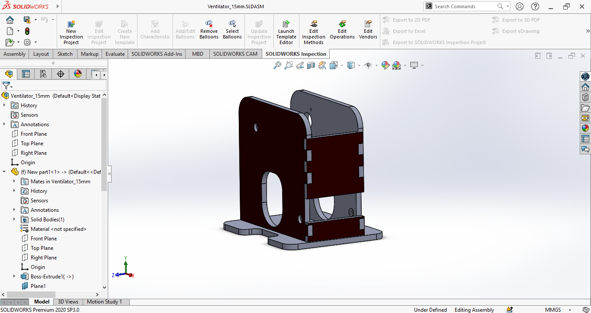

# Ventilator_Project

## The Repository
This repository is where Me and Chamika have developed a Opensource Ventilator Project in Corona Pandamic Situation as a group project on April of 2020. The main purpose of this project is to develop Portable Ventilator that can assist the patient lung pressure . And further more I use this project to develop my ability to work with the arduino and Solidworks and Matlab Designing Skills. I have published our full source code Design files in this repository. 

### The basic customized view of the Serach Results
[![Youtube Video]          // Title
(img/img1.png)] // Thumbnail
(https://youtu.be/OVwWnZSBNhI" Youtube")    // Video Link

### The basic customized view of the Serach Results

### The basic customized view of the UI

