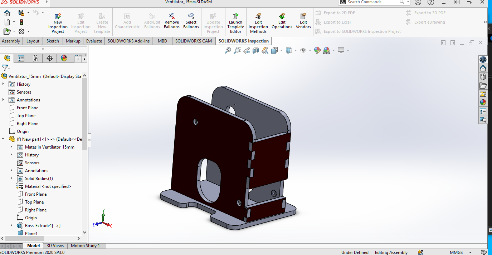

# Ventilator_Project

## The Repository
This repository is where Me and Chamika have developed a Opensource Ventilator Project in Corona Pandamic Situation as a group project on April of 2020. The main purpose of this project is to develop Portable Ventilator that can assist the patient lung pressure . And further more I use this project to develop my ability to work with the arduino and Solidworks and Matlab Designing Skills. I have published our full source code Design files in this repository. 

 

### Solidworks Assemble Design1

### Cam Mechanism Designing Using Matlab

